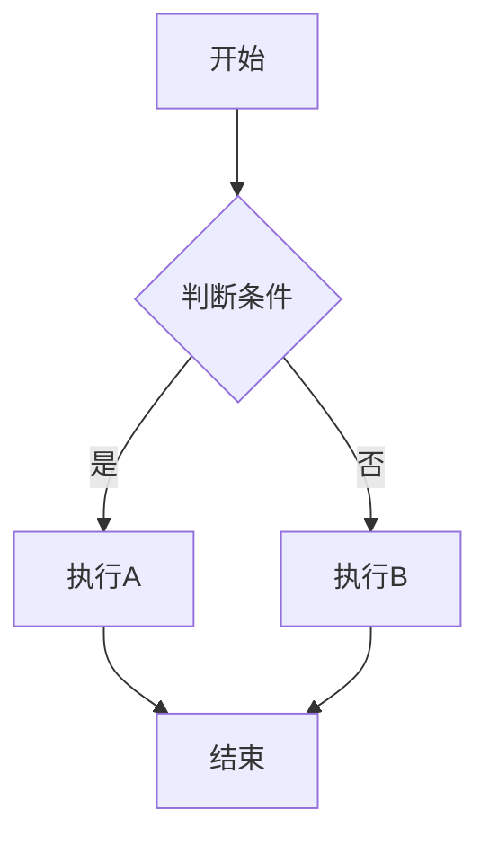

向量点积：向量\*向量->实数

`torch.dot（x,y）`

矩阵-向量积：矩阵（二维张量）\*向量->向量

`torch.mv(x,y)`

矩阵-矩阵乘法：矩阵\*矩阵->矩阵

`torch.mm（x,y）`

范数（Norm），其本质可近似理解为模长。公式为

$||x||_p = \sqrt[p]{\sum_i |x_i|^p}$

p>1，p范数为凸函数，p<1，p范数不为凸函数。范数的凸性对求解最优化问题很重要。


范数具有正定性、齐次性与三角不等式。正定性即范数≥0，当且仅当向量为0时范数为0。齐次性即对任意向量x与任一实数k，kx的范数等于k倍的x的范数。三角不等式很好理解，对任意向量x与y，x+y的范数要小于等于x的范数加上y的范数

p=1时，$||x||_p = \sqrt[p]{\sum_i |x_i|}$，其等高线为以原点为中心的菱形，计算向量n的L1范数

```plain
torch.abs(u).sum()
```

p=2时，$||x||_p = \sqrt[p]{\sum_i |x_i|^2}$，其等高线为以原点为中心的圆，计算向量n的L2范数

```plain
torch.norm(u)
```

当p->∞时，$||x||_p = \max \left ( \left | x_{i}  \right |  \right ) $

其中L0范数定义元素中非零元素的个数，不是严格的范数

一般机器学习里边常用的有L1-norm和L2-norm。

流程图


