***

## 1. 流程图 (Flowchart)

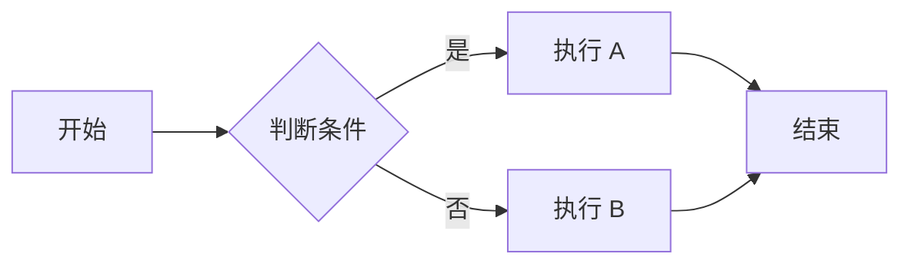

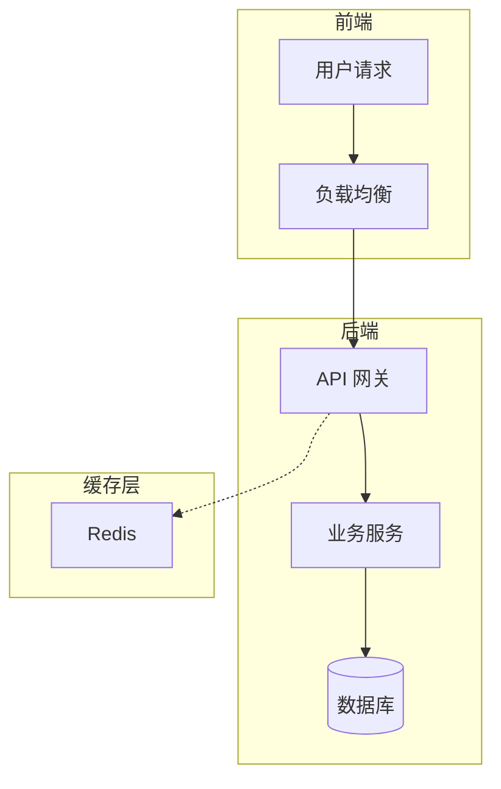

## 2. 时序图 (Sequence Diagram)

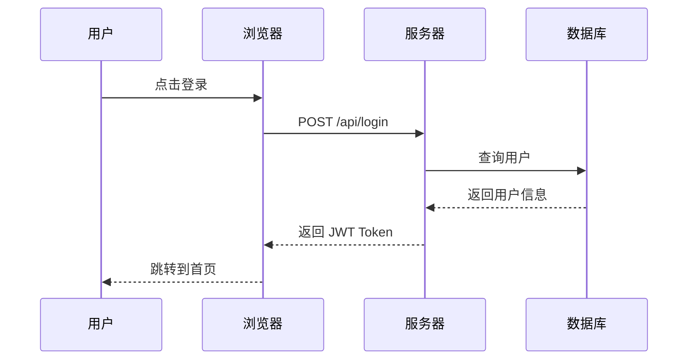

## 3. 类图 (Class Diagram)

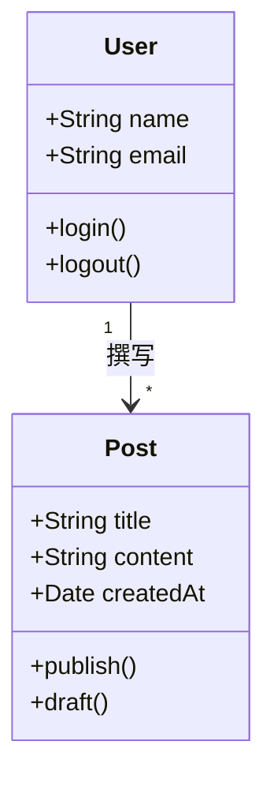

## 4. 状态图 (State Diagram)

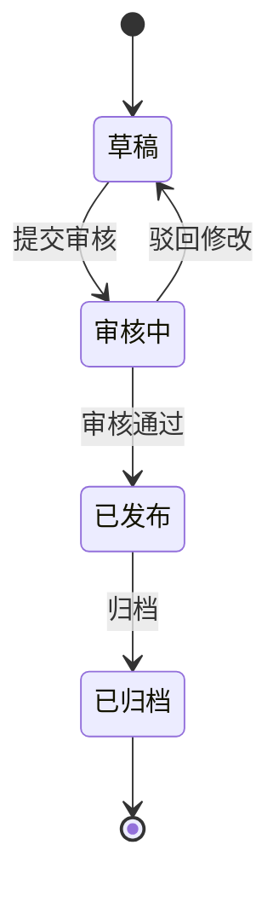

## 5. 甘特图 (Gantt Chart)

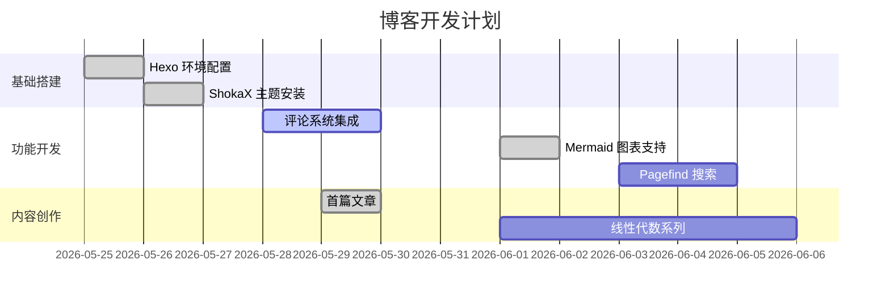

## 6. 饼图 (Pie Chart)

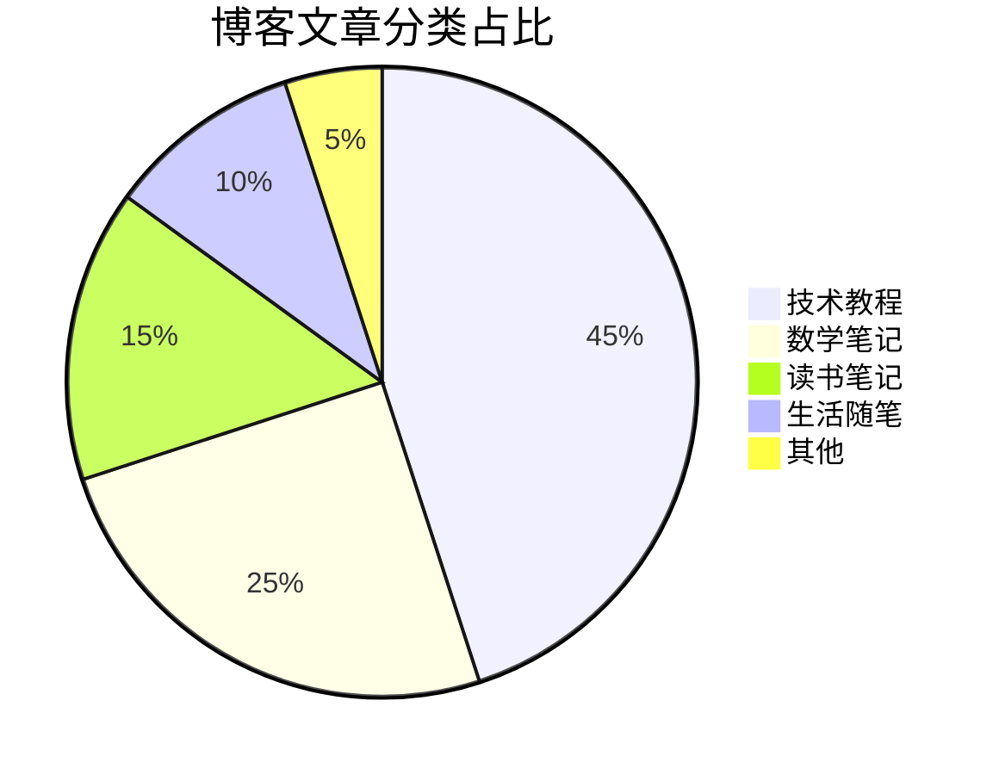

## 7. Git 图 (Git Graph)

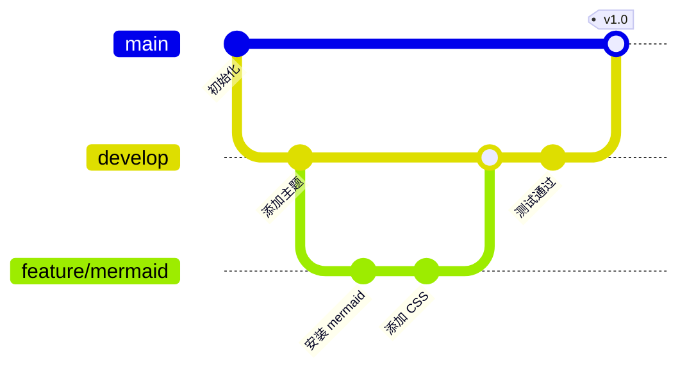

## 8. 思维导图 (Mindmap)

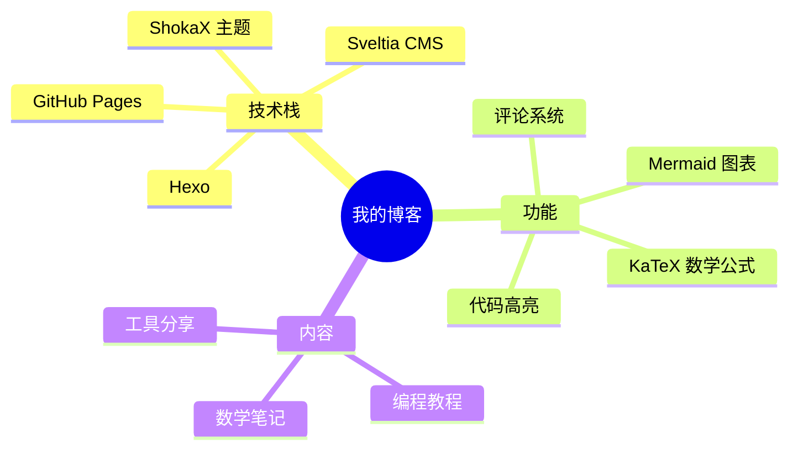

## 9. 时间线 (Timeline)

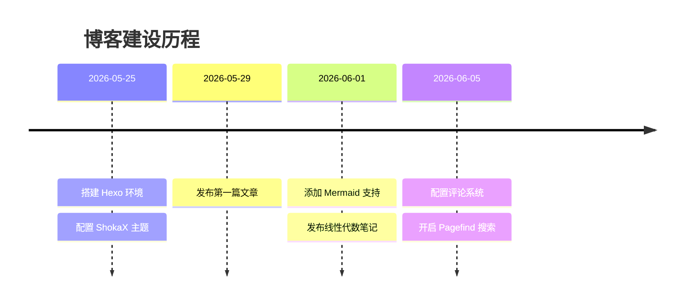

## 10. ER 图

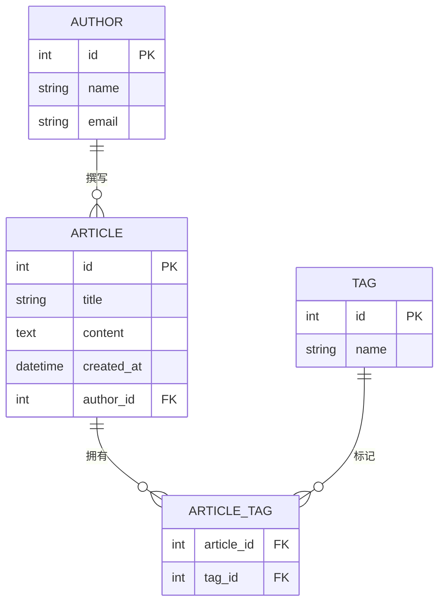
