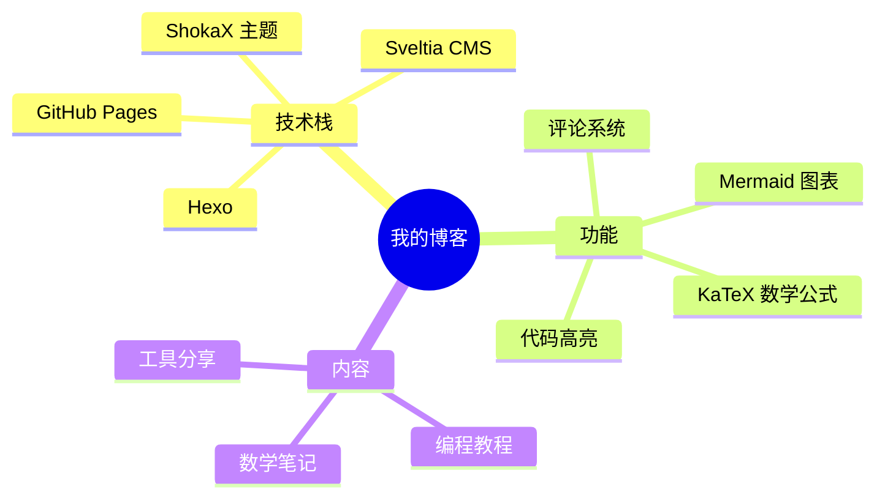

这是开始

```mermaid
mindmap
  root((我的博客))
    技术栈
      Hexo
      ShokaX 主题
      GitHub Pages
      Sveltia CMS
    功能
      Mermaid 图表
      KaTeX 数学公式
      代码高亮
      评论系统
    内容
      编程教程
      数学笔记
      工具分享
```

接下来
